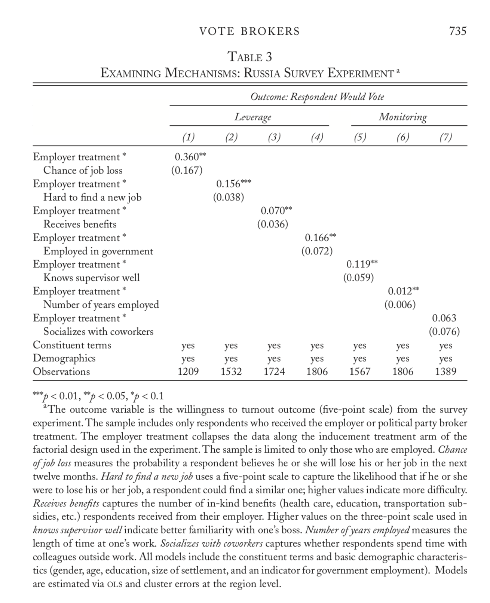

```{r setup, include=FALSE}
knitr::opts_chunk$set(echo = FALSE)

library(tinytex)
library(peRspective)
library(foreign)
library(data.table)
library(stargazer)
library(ggplot2)
library(xtable)
library(arm)
library(webshot)
library(mlogit)
library(naniar)
library(mice)
library(broom)
library(nnet)
library(ggpubr)
library(erer)
library(knitr)
library(huxtable)
library(lfe)
library(rms)
library(kableExtra)
library(tables)
library(formattable)
library(prediction)
library(glm.predict)
library(multcomp)
library(mfx)
library(gtable)
library(gridExtra)
library(grid)
library(stargazer)
library(data.table)
library(gt)
library(reprex)
library(tidyverse)

```


```{r loading data}

#### Load Each of the Survey Datasets
load("data/RussiaSurveyData.Rda")
load("data/VenezuelaSurveyData.Rda")

rus_emp<-subset(rus, employed==1)
ven_emp<-subset(ven, employed==1)

```

# Introduction

I am replicating "Vote Brokers, Clientelist Appeals, and Voter Turnout: Evidence from Russia and Venezuela" by Timothy Frye, Ora John Reuter and David Szakonyi.

# GitHub

All analysis for this paper be found in the original paper (https://www.cambridge.org/core/journals/world-politics/article/vote-brokers-clientelist-appeals-and-voter-turnout-evidence-from-russia-and-venezuela/45FE0BE1216FCD8744B02A82919B328A) and data verse (https://dataverse.harvard.edu/dataset.xhtml?persistentId=doi:10.7910/DVN/YSVMS2) My Github repo for this project is located under my username, cpatvakanian.  [^1]

# Paper Overview
For my final replication project, I decided to look at Vote Brokers, Clientelist Appeals, and Voter Turnout: Evidence from Russia and Venezuela, a paper by Timothy Frye, Ora John Reuter and David Szakonyi. The paper looks at two countries, Russia and Venezuela, to what factors, if any, in clientelist exchange. The authors specifically look at the role of brokers and leverage in these two cases. The study uses survey data to explore Russian and Venezuelan brokers and how they perform in monitoring voting.

The goal is basically to understand how are monitors pressured by upper management in order to carry out clientelism and skew the voting. To understand this, the authors use a few models, such as difference of means between the different type of brokers and methods of leveraging, in both Russia and Venezuela. They also run fixed effect linear regressions to see what influence the skewing of the voting turnout for a couple of different scenarios, but actually include very few variables in their regression which is strange. The paper also has very specific demographics of the type of individuals they are looking at, which is good because it is specific but might also be a drawback because it limits the scope of the study. This paper ultimately finds that in Russia and Venezuela, different types of brokers and methods can influence voter turnout differently, which seems to be expected. 

# What I was able to replicate

In this paper for the most part I was able to replicate all of the graphics. The tables I couldn't use the old code to make so I hand made them, which I think is not a good idea... I also had an issue combining some of the graphs to have the same legend. I also messed up some of the footnotes on the graphics, and instead used captions. On the regression, the variable order isn't like the original, which I couldn't figure out. Also, I had a lot of trouble getting the exact format from R things like GT to Latex/PDF, so that's why I had to resort to manually doing some things.

# Extension

For my extension, I decided to look at data structure and missing data.

```{r Missing Data Russia}

# I wanted to look at the missing data in my data
# set and see if there are any large gaps.

summary(rus)

# Looking at missing values for Russia

gg_miss_var(rus, show_pct = TRUE) +
  labs(y = "Viewing in terms of percentages is helpful")


gg_miss_var(rus,
            show_pct = TRUE,
            facet = broker)

```


```{r Missing Data Venezuela}


summary(ven)

# Looking at missing values for Russia

gg_miss_var(ven, show_pct = TRUE) +
  labs(y = "Viewing in terms of percentages is helpful")


gg_miss_var(ven,
            show_pct = TRUE,
            facet = broker)


```


```{r imputing data Russia, cache = TRUE}


#imp_1 <- mice(rus, nnet.MaxNWts = 2000)

#saveRDS(imp_1, file = "imputed_Russia.rds")

imp_1 <- read_rds("imputed_Russia.rds")


full <- complete(imp_1, 1)


gg_miss_var(full,
            show_pct = TRUE,
            facet = citysize)

new <- complete(imp_1, action="long", include = TRUE) %>% as_tibble()


```


```{r imputing data Venezuela, cache = TRUE}


#imp_2 <- mice(ven, nnet.MaxNWts = 2000)

#saveRDS(imp_2, file = "imputed_Venezuela.rds")

imp_2 <- read_rds("imputed_Venezuela.rds")

full2 <- complete(imp_2, 1)


gg_miss_var(full2,
           show_pct = TRUE,
            facet = citysize)

new2 <- complete(imp_2, action="long", include = TRUE) %>% as_tibble()


```


# Literature Review

For this paper I looked at a few papers on voting structure in Russia, as I was able to find less on Venezuela. In "How Capitalism was Built", by Anders Aslund, the literature suggests that in many post soviet countries, voting patterns were heavily influenced by the transition to democracy in instiutions built. In Russia, the case was that there was not enough a big push to transform after communism, and thus the country had to face more difficulties in long term in ensuring fair and free elections. Additionally, in Olga Popova's "Corruption, Voting and Employment Status: Evidence from Russian Parliamentary Elections", Popova finds that controlling for different employment statuses and corruption, people are stil likely to vote differently, and more corruption generally induces people to vote more, which I think is to expected.

# References

I make use of @aslund_2012, @popova, and @frye_reuter_szakonyi_2019. 

<div id="refs"></div>

# Appendix

```{r making figure 1}
# Creating first table with two panels

# Panel A - They create a table that shows
# the various likelihoods of people voting
# and specifies this using a gg plot. There is a lot 
# of formatting to make it the size, text, font, and labels
# desired. This is done for Russia and Venezeula

## Made continous scale....


####### Panel A

rus_d<-rus[rus$employed==1][,list(expoutcome_m=mean(expoutcome)),by=c("strategy","broker")]
rus_d$broker<-as.character(rus_d$broker)
rus_d$broker[rus_d$broker=="Employer"]<-" Employer"
rus_d$broker[rus_d$broker=="Party"]<-" Party Activist"
rus_d$broker[rus_d$broker=="Official"]<-"Government Official"

fig1_panela<-ggplot(data=rus_d, aes(x=broker, y=expoutcome_m, fill=strategy)) + geom_bar(colour="black", stat="identity",position=position_dodge(),size=.3)+ scale_fill_grey( name="",breaks=c("0", "1", "2","3"),labels=c("Simple Ask     ", "Organizational Threat     ", "Turnout-Buying     ","Individual Threat"))+    xlab("") + ylab("Likelihood of Voting") + theme_bw()+ theme(legend.position="bottom",axis.text=element_text(size=10),axis.text.x=element_text(face = "bold"),axis.title.y=element_text(size=10),legend.text=element_text(size=10),plot.title = element_text(hjust = 0.5,size=14),plot.caption = element_text(hjust = 0))+ coord_cartesian(ylim=c(2.25,3.25))+ geom_text(aes(label=specify_decimal(expoutcome_m,2)), position=position_dodge(width=0.9), vjust=-0.4)+ggtitle("Panel A: Russia Survey")

####### Panel B

ven_d<-ven[ven$employed==1][,list(vote_intent_m=mean(vote_intent,na.rm=TRUE)),by=c("strategy_number","broker")]
ven_d$broker<-as.character(ven_d$broker)
ven_d$broker[ven_d$broker=="Employer"]<-" Employer"
ven_d$broker[ven_d$broker=="Party"]<-" Party Activist"
ven_d$broker[ven_d$broker=="Official"]<-"Neighborhood Leader"

fig1_panelb<-ggplot(data=ven_d, aes(x=broker, y=vote_intent_m, fill=strategy_number)) + geom_bar(colour="black", stat="identity",position=position_dodge(),size=.3)+ scale_fill_grey( name="",breaks=c("0", "1", "2","3"),labels=c("Simple Ask     ", "Organizational Threat     ", "Turnout-Buying     ","Individual Threat"))+    xlab("") + ylab("Likelihood of Voting") + theme_bw()+ theme(legend.position="bottom",axis.text=element_text(size=10),axis.text.x=element_text(face = "bold"),axis.title.y=element_text(size=10),legend.text=element_text(size=10),plot.title = element_text(hjust = 0.5,size=14),plot.caption = element_text(hjust = 0))+ coord_cartesian(ylim=c(2,4.5))+ geom_text(aes(label=specify_decimal(vote_intent_m,2)), position=position_dodge(width=0.9), vjust=-0.4)+ggtitle("\n\nPanel B: Venezuela Survey")


ggarrange(fig1_panela, fig1_panelb, ncol=1, nrow=2, common.legend = TRUE, legend="bottom") + 
  labs(caption = "The figure displays the difference in the likelihood of voting among all respondents to the survey experiment.\nVoting likelihood is measured on a five-point scale, with higher values indicating increased likelihood.\nMean values for each treatment group are found above each bar and are organized according to which broker was\nresponsible for voter mobilization.The sample is a subset of only employed respondents.")
```

```{r making figure 2}

# I don't understand what's going on here with the
# interval but I guess he is showing some kind of 
# interval he'd like to have the error display 
# on the graphic which display difference of means

interval <- -qnorm((1-0.95)/2)  # 95% multiplier

# This code produces Panel A which is separated based on each country
# and looks at brokers vs inducements

# This code here is to specify the employed brokers in several categories and their
# differences using a linear regression
emp_diff<-lm(expoutcome~factor(employer4), data=subset(rus,employed==1))
party_diff<-lm(expoutcome~factor(activist4), data=subset(rus,employed==1))
official_diff<-lm(expoutcome~factor(official4), data=subset(rus,employed==1))

# He we have displayed the various inducements applied and again using
# the linear regression to get the differnce of means

gift_diff<-lm(expoutcome~factor(gift4), data=subset(rus,employed==1))
threat_diff<-lm(expoutcome~factor(threat4), data=subset(rus,employed==1))
benign_diff<-lm(expoutcome~factor(benign4), data=subset(rus,employed==1))
org_diff<-lm(expoutcome~factor(org4), data=subset(rus,employed==1))

# Here creating a coeffiecents column in order to make sure there are fixed effects accounted for
coefficients<-data.frame(var=as.character(),fe = as.numeric(),se= as.numeric(), subset=as.character())

# Here we are setting the standard error between the 
# different inducements in order to get the proper displayed
# numbers in the table

coefficients<-rbind(coefficients,data.frame(var="strategies",fe = summary(benign_diff)$coefficients[,1][2],se= summary(benign_diff)$coefficients[,2][2], subset="Simple Ask     "))

coefficients<-rbind(coefficients,data.frame(var="strategies",fe = summary(org_diff)$coefficients[,1][2],se= summary(org_diff)$coefficients[,2][2], subset="Organizational Threat     "))

coefficients<-rbind(coefficients,data.frame(var="strategies",fe = summary(gift_diff)$coefficients[,1][2],se= summary(gift_diff)$coefficients[,2][2], subset="Turnout-Buying     "))

coefficients<-rbind(coefficients,data.frame(var="strategies",fe = summary(threat_diff)$coefficients[,1][2],se= summary(threat_diff)$coefficients[,2][2], subset="Individual Threat"))

# Again doing the same as the above except for the brokers in this case, parsing
# for the different types of brokers
coefficients<-rbind(coefficients,data.frame(var="brokers",fe = summary(emp_diff)$coefficients[,1][2],se= summary(emp_diff)$coefficients[,2][2], subset="Employer"))
coefficients<-rbind(coefficients,data.frame(var="brokers",fe = summary(party_diff)$coefficients[,1][2],se= summary(party_diff)$coefficients[,2][2], subset="Party Activist"))
coefficients<-rbind(coefficients,data.frame(var="brokers",fe = summary(official_diff)$coefficients[,1][2],se= summary(official_diff)$coefficients[,2][2], subset="Government Official"))

# not sure what's going on here
coefficients <- within(coefficients,
                       var <- ordered(var, levels = rev(sort(unique(var)))))
secbreaks = rev(unique(as.character(coefficients$var)))

# Creating the GG plot for this graph again with the visual 
# specifications and making sure that the se error range is displayed

fig2_panela<-ggplot(coefficients, aes(colour = subset))+ geom_hline(yintercept = 0, colour = gray(1/2), lty = 2)+ geom_linerange(aes(x = var, ymin = fe - se*interval, ymax = fe + se*interval),lwd = 1, position = position_dodge(width = 1/2))+ geom_pointrange(aes(x = var, y = fe, ymin = fe - se*interval,ymax = fe + se*interval), lwd = 1/2, position = position_dodge(width = 1/2), shape = 21, fill = "WHITE")+ theme_bw()+ ylab("Difference in Means")+ xlab(" ")+ scale_x_discrete(breaks=secbreaks,labels=c('Difference: Between Brokers','\nDifference: Between Inducements')) + guides(colour=guide_legend(ncol=2))+ scale_colour_grey(name="Inducements                              Brokers")+theme(axis.text = element_text(size=10),axis.title = element_text(size=12),legend.text=element_text(size=10),plot.title = element_text(hjust = 1.25,size=10))+ggtitle("Panel A: Russia Survey")

####### Panel B - EXACT SAME THING AS ABOVE FOR VENEZUELA!

### Brokers
emp_diff<-lm(vote_intent~factor(employer), data=subset(ven,employed==1))
party_diff<-lm(vote_intent~factor(partyactivist), data=subset(ven,employed==1))
leader_diff<-lm(vote_intent~factor(leader), data=subset(ven,employed==1))

### Strategies
gift_diff<-lm(vote_intent~factor(gift), data=subset(ven,employed==1))
threat_diff<-lm(vote_intent~factor(indthreat), data=subset(ven,employed==1))
benign_diff<-lm(vote_intent~factor(benign), data=subset(ven,employed==1))
org_diff<-lm(vote_intent~factor(orgthreat), data=subset(ven,employed==1))

coefficients<-data.frame(var=as.character(),fe = as.numeric(),se= as.numeric(), subset=as.character())

coefficients<-rbind(coefficients,data.frame(var="strategies",fe = summary(benign_diff)$coefficients[,1][2],se= summary(benign_diff)$coefficients[,2][2], subset="Simple Ask     "))
coefficients<-rbind(coefficients,data.frame(var="strategies",fe = summary(org_diff)$coefficients[,1][2],se= summary(org_diff)$coefficients[,2][2], subset="Organizational Threat     "))
coefficients<-rbind(coefficients,data.frame(var="strategies",fe = summary(gift_diff)$coefficients[,1][2],se= summary(gift_diff)$coefficients[,2][2], subset="Turnout-Buying     "))
coefficients<-rbind(coefficients,data.frame(var="strategies",fe = summary(threat_diff)$coefficients[,1][2],se= summary(threat_diff)$coefficients[,2][2], subset="Individual Threat"))

coefficients<-rbind(coefficients,data.frame(var="brokers",fe = summary(emp_diff)$coefficients[,1][2],se= summary(emp_diff)$coefficients[,2][2], subset="Employer"))
coefficients<-rbind(coefficients,data.frame(var="brokers",fe = summary(party_diff)$coefficients[,1][2],se= summary(party_diff)$coefficients[,2][2], subset="Party Activist"))
coefficients<-rbind(coefficients,data.frame(var="brokers",fe = summary(leader_diff)$coefficients[,1][2],se= summary(leader_diff)$coefficients[,2][2], subset="Neighborhood Leader"))

coefficients <- within(coefficients,
                       var <- ordered(var, levels = rev(sort(unique(var)))))
secbreaks = rev(unique(as.character(coefficients$var)))

fig2_panelb<-ggplot(coefficients, aes(colour = subset))+ geom_hline(yintercept = 0, colour = gray(1/2), lty = 2)+ geom_linerange(aes(x = var, ymin = fe - se*interval, ymax = fe + se*interval),lwd = 1, position = position_dodge(width = 1/2))+ geom_pointrange(aes(x = var, y = fe, ymin = fe - se*interval,ymax = fe + se*interval), lwd = 1/2, position = position_dodge(width = 1/2), shape = 21, fill = "WHITE")+ theme_bw()+ ylab("Difference in Means")+ xlab(" ")+ scale_x_discrete(breaks=secbreaks,labels=c('Difference: Between Brokers','\nDifference: Between Inducements')) +  guides(colour=guide_legend(ncol=2))+ scale_colour_grey(name="Inducements                              Brokers")+theme(axis.text = element_text(size=10),axis.title = element_text(size=12),legend.text=element_text(size=10),plot.title = element_text(hjust = 1.25,size=10))+ggtitle("Panel B: Venezuela Survey")


ggarrange(fig2_panela, fig2_panelb, ncol=1, nrow=2, common.legend = TRUE, legend="bottom")

# Set height and width options

```


```{r making figure 3}
# Similar concept to above, making a visual
# reprentation of the difference of means
# except in this case looking at treated vs
# non treated


# creating dataframe upon which the authors later
# add data to create table
df <- data.frame(name= numeric(0),coefs= numeric(0),se= numeric(0),value= numeric(0))

### First we are looking at the effect of leverage
# on the subgroups specified

# I think this is creating a specific characteristic of person they want
# to count but i am not certain
est1<-felm(expoutcome~empparty*perclosejob100+ citysize +  male + logage + edu+ gov|factor(strategy)|0|regionid, data=subset(rus, employed==1))

# I think this is adding another column to dataframe in order to make
# a variable of close to the employer, but the variable name is confusing
df<-rbind(df,cbind("perclosejob100",
                   summary(glht(est1, linfct = c("empparty + empparty:perclosejob100 == 0")))$test$coefficients,
                   summary(glht(est1, linfct = c("empparty + empparty:perclosejob100 == 0")))$test$sigma,"1"))

df<-rbind(df,cbind("perclosejob100",
                   summary(glht(est1, linfct = c("empparty==0")))$test$coefficients,
                   summary(glht(est1, linfct = c("empparty==0")))$test$sigma,"0"))

# Here adding a varible for the dataframe to count people who 
# monitoring and within the newer group
est2<-felm(expoutcome~empparty*findnewwork+ citysize +  male + logage + edu + gov|factor(strategy)|0|regionid, data=subset(rus, employed==1))

df<-rbind(df,cbind("findnewwork",
                   summary(glht(est2, linfct = c("empparty + empparty:findnewwork*5 == 0")))$test$coefficients,
                   summary(glht(est2, linfct = c("empparty + empparty:findnewwork*5 == 0")))$test$sigma,"1"))

df<-rbind(df,cbind("findnewwork",
                   summary(glht(est2, linfct = c("empparty==0")))$test$coefficients,
                   summary(glht(est2, linfct = c("empparty==0")))$test$sigma,"0"))

rus$num_benefits<-as.numeric(as.character(rus$num_benefits))
est3<-felm(expoutcome~empparty*num_benefits+ citysize +  male + logage + edu+ gov|factor(strategy)|0|regionid, data=subset(rus, employed==1))

# adding a variable that is part of leverage subgroup for
# someone receiving benefits
df<-rbind(df,cbind("num_benefits",
                   summary(glht(est3,linfct = c("empparty + empparty:num_benefits == 0")))$test$coefficients,
                   summary(glht(est3, linfct = c("empparty + empparty:num_benefits == 0")))$test$sigma,"1"))

df<-rbind(df,cbind("num_benefits",
                   summary(glht(est3, linfct = c("empparty==0")))$test$coefficients,
                   summary(glht(est3, linfct = c("empparty==0")))$test$sigma,"0"))

# Again, same as above except for people employed
# in the government
est4<-felm(expoutcome~empparty*gov+ citysize +  male + logage + edu+gov|factor(strategy)|0|regionid, data=subset(rus, employed==1))

df<-rbind(df,cbind("gov",
                   summary(glht(est4, linfct = c("empparty + empparty:gov == 0")))$test$coefficients,
                   summary(glht(est4, linfct = c("empparty + empparty:gov == 0")))$test$sigma,"1"))

df<-rbind(df,cbind("gov",
                   summary(glht(est4, linfct = c("empparty==0")))$test$coefficients,
                   summary(glht(est4, linfct = c("empparty==0")))$test$sigma,"0"))

### Here creating the same variables as above and adding more values to the 
# data frame for their subgroups, except for MONITORING

est5<-felm(expoutcome~empparty*supervisor+ citysize +  male + logage + edu+ gov|factor(strategy)|0|regionid, data=subset(rus, employed==1))


df<-rbind(df,cbind("supervisor",
                   summary(glht(est5, linfct = c("empparty + empparty:supervisor*3 == 0")))$test$coefficients,
                   summary(glht(est5, linfct = c("empparty + empparty:supervisor*3 == 0")))$test$sigma,"1"))

df<-rbind(df,cbind("supervisor",
                   summary(glht(est5, linfct = c("empparty==0")))$test$coefficients,
                   summary(glht(est5, linfct = c("empparty==0")))$test$sigma,"0"))

est6<-felm(expoutcome~empparty*lengthwork+ citysize +  male + logage + edu+ gov|factor(strategy)|0|regionid, data=subset(rus, employed==1))

df<-rbind(df,cbind("lengthwork",
                   summary(glht(est6, linfct = c("empparty + empparty:lengthwork*50 == 0")))$test$coefficients,
                   summary(glht(est6, linfct = c("empparty + empparty:lengthwork*50 == 0")))$test$sigma,"1"))

df<-rbind(df,cbind("lengthwork",
                   summary(glht(est6, linfct = c("empparty==0")))$test$coefficients,
                   summary(glht(est6, linfct = c("empparty==0")))$test$sigma,"0"))


est7<-felm(expoutcome~empparty*coworker_weekly+ citysize +  male + logage + edu+ gov|factor(strategy)|0|regionid, data=subset(rus, employed==1))

df<-rbind(df,cbind("coworker_weekly",
                   summary(glht(est7, linfct = c("empparty + empparty:coworker_weekly*2 == 0")))$test$coefficients,
                   summary(glht(est7, linfct = c("empparty + empparty:coworker_weekly*2 == 0")))$test$sigma,"1"))

df<-rbind(df,cbind("coworker_weekly",
                   summary(glht(est7, linfct = c("empparty==0")))$test$coefficients,
                   summary(glht(est7, linfct = c("empparty==0")))$test$sigma,"0"))

# not sure what's going on here again with the coefficients column
# but it seems to make sense
coefficients <- within(coefficients,
                       var <- ordered(var, levels = rev(sort(unique(var)))))
secbreaks = rev(unique(as.character(coefficients$var)))


# Here creating new variable names so that it be easily
# put into the gg plot below and adding the variables
# to the datafarme as characters
names(df)<-c("variable","coef","se","on")
df$leverage<-c(rep(1,8),rep(0,6))
df$coef<-as.numeric(as.character(df$coef))
df$se<-as.numeric(as.character(df$se))
df$variable<-as.character(df$variable)
df$variable[df$variable=="perclosejob100"]<-"     perclosejob100"
df$variable[df$variable=="findnewwork"]<-"    findnewwork"
df$variable[df$variable=="num_benefits"]<-"    num_benefits"
df$variable[df$variable=="gov"]<-"   gov"
df$variable[df$variable=="supervisor"]<-"  supervisor"
df$variable[df$variable=="lengthwork"]<-" lengthwork"
df$variable[df$variable=="coworker_weekly"]<-"coworker_weekly"
df$leverage<-as.character(df$leverage)

# I don't exactly know what's going on here
# but I don think they are just going through and 
# making certain variables factors

df$variablewhite = factor(df$variable, levels=c("Leverage ","     perclosejob100","    findnewwork", "    num_benefits","   gov","Monitoring","  supervisor"," lengthwork","coworker_weekly"))

# I don't know what's happening here at all
df$variablefill<-paste(df$variable,df$on,sep="_")


# Here creating a ggplot with variables to 
# a table that shows the standard errors
# of the different respondents
fig3<-ggplot(df, aes(colour = variable,fill=variablefill))+ geom_linerange(aes(x = variablefill, ymin = coef - se*interval, ymax = coef + se*interval),lwd = 1, position = position_dodge(width = 1/2))+ geom_pointrange(aes(x = variablefill, y = coef, ymin = coef - se*interval,ymax = coef + se*interval), lwd = 1/2, position = position_dodge(width = 1/2), shape = 21, fill = "WHITE")+ geom_hline(yintercept = 0, colour = gray(1/2), lty = 2)+ theme_bw()+ scale_x_discrete(breaks=df$variablefill,labels=c('100','0','Yes','No','Yes','No','Yes','No','Yes','No','50','0','Yes','No'))+ ylab("Effect of Employer Treatment\n on Turnout")+ xlab("\nLeverage                            Monitoring")+
  guides(colour=guide_legend(ncol=2))+ scale_colour_grey(name="",labels = c("Chance of Job Loss", "Hard to Find a New Job","Receives Benefits","Employed in Government","Knows Supervisor Well","Number of Years Employed","Socializes with Coworkers"))+theme(legend.position="bottom",axis.text = element_text(size=10),axis.title = element_text(size=12),legend.text=element_text(size=8))

fig3
```

```{r creating table 1, results= "asis"}

# Here the Authors are making panel A of the graphic a
# and their probabilities of voting which it looks like
# is just from summary statistics

# this is for Russia, and below it is the same thing for
# Venezuela. Though this is miassing the code which has the note
# and also missing the code which binds the two tables together

rus$induce="Asked You to Vote"
rus$induce[rus$gift4==1]="Offers You a Gift, Money, or Reward for Voting"
rus$induce[rus$org4==1]="Tells You That Your Firm or Org. Will Suffer if Turnout Among Employees is Low"
rus$induce[rus$threat4==1]="Indicates There Will be Negative Consequences For You If You Do Not Vote"

rus$brokertable="  Your Employer"
rus$brokertable[rus$broker=="Party"]=" A Party Activist"
rus$brokertable[rus$broker=="Official"]="A Government Official"

RussiaPercTable <- table(rus$brokertable,rus$induce)
RussiaPercTable

### Panel B

#ven$induce="Asked You to Vote"
#ven$induce[ven$strategy=="Gift"]="Offers You a Gift, Money, or Reward for Voting"
#ven$induce[ven$strategy=="OrgThreat"]="Tells You That Your Firm or Org. Will Suffer if Turnout Among Employees is Low"
#ven$induce[ven$strategy=="IndThreat"]="Indicates There Will be Negative Consequences For You If You Do Not Vote"

#ven$brokertable="  Your Employer"
#ven$brokertable[ven$broker=="Party"]=" A Party Activist"
#ven$brokertable[ven$broker=="Neighborhood Leader"]="A Neighborhood Leader"

#VenezuelaPercTable<-table(ven$brokertable,ven$induce)

# MAke sure to code and pull data exactly from their paper 

# Create my_first_data_table
Russia_Survey <- tibble("Broker" = c("Your Employer", "A Party Activist", "A Neighborhood Leader"), 
                                  "Asked You to Vote" = c(344, 336, 339),
                                  "Indicates There Will be Negative Consequences For You If You Do Not Vote" = c(344,353,337),
                                  "Offers You a Gift, Money, or Reward for Voting" = c(374,360,352),
                                  "Tells You That Your Firm or Org. Will Suffer if Turnout Among Employees is Low" = c(372,362,331))  

Russia_Survey


Venezuela_Survey <- tibble("Broker" = c("Your Employer", "A Party Activist", "A Neighborhood Leader"), 
                                  "Asked You to Vote" = c(96, 94, 125),
                                  "Indicates There Will be Negative Consequences For You If You Do Not Vote" = c(132,133,118),
                                  "Offers You a Gift, Money, or Reward for Voting" = c(113,113,120),
                                  "Tells You That Your Firm or Org. Will Suffer if Turnout Among Employees is Low" = c(114,118,124))  

```
\begin{center}
Table 1: Survey Coverage

Russian Survey
(a)


```{r table 1 part 1, results = "asis" }

kable(Russia_Survey, format = "latex") %>%
kable_styling(full_width = T)
  
#Try exploring options


```
\newline
Venezuelan Survey
(b)


```{r table 1 part 2, results = "asis"}
kable(Venezuela_Survey, format = "latex") %>%
kable_styling(full_width = T)
```


```{r creating table 2}

# I think this is making some of the data factor 
# so it can be put in normally when inputted into the table
rus_emp$expoutcome_f<-factor(rus_emp$expoutcome)

# Here is using a predict function to run a regression
# and then predict the probabbility of voting for employers
# and the here is logistic dependent variable as a binary
# which makes sense since you are either an employer or not
# then that result gets added to a new dataframe

t<-polr(expoutcome_f~employer4,data=rus_emp, method = "logistic")
probs<-as.data.frame(predict(t, type="probs"))
names(probs)=c("o1","o2","o3","o4","o5")
rus_p<-cbind(rus_emp,probs)
rusemployer_high<-mean(rus_p$o4[rus_p$employer4==1]) + mean(rus_p$o5[rus_p$employer4==1])
rusemployer_low<-mean(rus_p$o1[rus_p$employer4==1]) + mean(rus_p$o2[rus_p$employer4==1])

### Same as before for Activists
t<-polr(expoutcome_f~activist4,data=rus_emp, method = "logistic")
probs<-as.data.frame(predict(t, type="probs"))
names(probs)=c("o1","o2","o3","o4","o5")
rus_p<-cbind(rus_emp,probs)
rusactivist_high<-mean(rus_p$o4[rus_p$activist4==1]) + mean(rus_p$o5[rus_p$activist4==1])
rusactivist_low<-mean(rus_p$o1[rus_p$activist4==1]) + mean(rus_p$o2[rus_p$activist4==1])


### Same as before for Official
t<-polr(expoutcome_f~official4,data=rus_emp, method = "logistic")
probs<-as.data.frame(predict(t, type="probs"))
names(probs)=c("o1","o2","o3","o4","o5")
rus_p<-cbind(rus_emp,probs)
rusofficial_high<-mean(rus_p$o4[rus_p$official4==1]) + mean(rus_p$o5[rus_p$official4==1])
rusofficial_low<-mean(rus_p$o1[rus_p$official4==1]) + mean(rus_p$o2[rus_p$official4==1])


# Creating the exact same thing except for VENEZUELA

ven_emp$vote_intent_f<-factor(ven_emp$vote_intent)
ven_f<-subset(ven_emp, is.na(vote_intent_f)==FALSE)

### Employer
t<-polr(vote_intent_f~employer,data=ven_f, method = "logistic")
probs<-as.data.frame(predict(t, type="probs"))
names(probs)=c("o1","o2","o3","o4","o5")
ven_p<-cbind(ven_f,probs)
venemployer_high<-mean(ven_p$o4[ven_p$employer==1]) + mean(ven_p$o5[ven_p$employer==1])
venemployer_low<-mean(ven_p$o1[ven_p$employer==1]) + mean(ven_p$o2[ven_p$employer==1])

### Activist
t<-polr(vote_intent_f~partyactivist,data=ven_f, method = "logistic")
probs<-as.data.frame(predict(t, type="probs"))
names(probs)=c("o1","o2","o3","o4","o5")
ven_p<-cbind(ven_f,probs)
venactivist_high<-mean(ven_p$o4[ven_p$partyactivist==1]) + mean(ven_p$o5[ven_p$partyactivist==1])
venactivist_low<-mean(ven_p$o1[ven_p$partyactivist==1]) + mean(ven_p$o2[ven_p$partyactivist==1])

### Leader
t<-polr(vote_intent_f~leader,data=ven_f, method = "logistic")
probs<-as.data.frame(predict(t, type="probs"))
names(probs)=c("o1","o2","o3","o4","o5")
ven_p<-cbind(ven_f,probs)
venleader_high<-mean(ven_p$o4[ven_p$leader==1]) + mean(ven_p$o5[ven_p$leader==1])
venleader_low<-mean(ven_p$o1[ven_p$leader==1]) + mean(ven_p$o2[ven_p$leader==1])


# Here creating a summary table for the Russian and Venezuelan case
# and allowing for the probabilities displayed as decimals
# to be nomral percents

PanelASummaryTable <- data.frame(brokers= numeric(0),rusprob= numeric(0),venprob= numeric(0))
PanelASummaryTable[1 ,] <- c("Employer",specify_decimal(c(rusemployer_high*100,venemployer_high*100),1))
PanelASummaryTable[2 ,] <- c("Party Activist",specify_decimal(c(rusactivist_high*100,venactivist_high*100),1))
PanelASummaryTable[3 ,] <- c("Government Official",specify_decimal(rusofficial_high*100,1),"")
PanelASummaryTable[4 ,] <- c("Neighborhood Leader","",specify_decimal(venleader_high*100,1))

colnames(PanelASummaryTable) <- c(" ","Russia","Venezuela")

# Again here creating a summary table except for those not
# voting, though I am not entirely certain

PanelBSummaryTable <- data.frame(brokers= numeric(0),rusprob= numeric(0),venprob= numeric(0))

PanelBSummaryTable[1 ,] <- c("Employer",specify_decimal(c(rusemployer_low*100,venemployer_low*100),1))
PanelBSummaryTable[2 ,] <- c("Party Activist",specify_decimal(c(rusactivist_low*100,venactivist_low*100),1))
PanelBSummaryTable[3 ,] <- c("Government Official",specify_decimal(rusofficial_low*100,1),"")
PanelBSummaryTable[4 ,] <- c("Neighborhood Leader","",specify_decimal(venleader_low*100,1))

colnames(PanelBSummaryTable) <- c(" ","Russia","Venezuela")

```

Table 2: Substantive Effects: Predicted Probabilities by Broker Treatment

Probability of Voting (\%)

(a)

```{r table 2 part 1}
kable(PanelASummaryTable)
```

Probability of Not Voting (\%)

(b)
```{r table 2 part 2}
kable(PanelBSummaryTable)
```

\end{center}
```{r creating table 3}

# Using Russian data, here the autors are creating a table which shows a fixed effects linear
# model which is showing the outcome variable of voting, which
# is used since the paper wants to see the fixed effects based on the different
# categories of leverage, which in this case are people close they are to the job, 
# how they use network, how many benefits, and if they are government worker

est1 <-felm(expoutcome~empparty*perclosejob100+ citysize +  male + logage + polinterest  + edu+ gov|factor(strategy)|0|regionid, data=subset(new, employed==1))

est2 <-felm(expoutcome~empparty*findnewwork+ citysize +  male + logage + polinterest  + edu + gov|factor(strategy)|0|regionid, data=subset(new, employed==1))

est3 <-felm(expoutcome~empparty*num_benefits+ citysize +  male + logage + polinterest  + edu+ gov|factor(strategy)|0|regionid, data=subset(new, employed==1))

est4 <-felm(expoutcome~empparty*gov+ citysize +  male + logage + polinterest  + edu+ gov|factor(strategy)|0|regionid, data=subset(new, employed==1))

# Exact same thing as above except looking now at the same regression
# for the broker variables.

est5<-felm(expoutcome~empparty*supervisor+ citysize +  male + logage + polinterest  + edu+ gov|factor(strategy)|0|regionid, data=subset(new, employed==1))

est6<-felm(expoutcome~empparty*lengthwork+ citysize +  male + logage + polinterest  + edu+ gov|factor(strategy)|0|regionid, data=subset(new, employed==1))

est7<-felm(expoutcome~empparty*coworker_weekly+ citysize +  male + logage + polinterest  + edu+ gov|factor(strategy)|0|regionid, data=subset(new, employed==1))

```


```{r stargazer, results="asis", echo=FALSE, warning= FALSE}

# Problem is from emp*party being in every single regression or GOV

# I wasn't getting any parsing issues
# but I had that error so I put warning equals false

# I had some trouble geting rid of residual standard error
# and also was a little stuck on putting the demographics
# and constituent terms like in the original paper. Also,
# some of the smaller formatting and labelling issues I didn't
# address but I will fix them in the future.

stargazer(est1, est2, est3,est4, est5, est6, est7, header = FALSE,
          dep.var.labels=c("Outcome Respondent Would Vote"),
          title = "Table 3",
      notes = "\\parbox[t]{10cm}{The outcome variable is the willingness to turnout outcome (five-point scale) from the survey
experiment. The sample includes only respondents who received the employer or political party broker treatment. The employer treatment collapses the data along the inducement treatment arm of the factorial design used in the experiment. The sample is limited to only those who are employed. Chance of job loss measures the probability a respondent believes he or she will lose his or her job in the next twelve months. Hard to find a new job uses a five-point scale to capture the likelihood that if he or she were to lose his or her job, a respondent could find a similar one; higher values indicate more difficulty. Receives benefits captures the number of in-kind benefits (health care, education, transportation sub- sidies, etc.) respondents received from their employer. Higher values on the three-point scale used in knows supervisor well indicate better familiarity with one’s boss. Number of years employed measures the length of time at one’s work. Socializes with coworkers captures whether respondents spend time with colleagues outside work. All models include the constituent terms and basic demographic characteris- tics (gender, age, education, size of settlement, and an indicator for government employment). Models are estimated via ols and cluster errors at the region level.}",
      single.row = FALSE,
          column.sep.width = "-5pt",
      keep=c("empparty:perclosejob100","empparty:findnewwork","empparty:num_benefits","empparty:gov","empparty:supervisor","empparty:lengthwork","empparty:coworker_weekly" ),
      column.labels   = c("Leverage", "Monitoring"),
df = FALSE,
      omit.stat=c("rsq","adj.rsq", "ser"),
        column.separate = c(4, 3),
      order = c(4,1,2,3,5,6,7))

```



[^1]: [(https://github.com/cpatvakanian/milestone_6)] 
